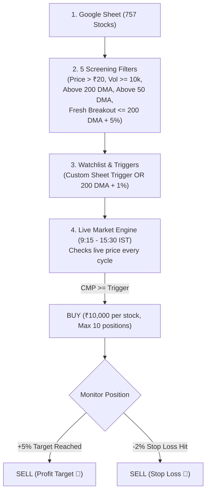

# 🧠 Trading System Logic & Architecture Guide

Welcome! This file explains the **complete trading logic** applied by this paper trading system in **simple, everyday language**.

Use this guide whenever you want to understand how trades happen, modify rules, or add new purchase conditions.

---

## 📌 High-Level Summary (How It Works in 4 Steps)

---

## 1️⃣ Step 1: Reading the Google Sheet

The system reads your single unified Google Sheet:
- **Sheet Link:** `https://docs.google.com/spreadsheets/d/1EKaY7YGSgQWnPrs57naHhJCSHp7VJ_PvXdFhzBfow1w/edit?usp=sharing`
- **Total Stocks:** 757 NSE/BSE stocks.
- **Data extracted per stock:**
  - `Symbol` (e.g., `ACMESOLAR`, `ABB`, `RELIANCE`)
  - `Stock Name`
  - `Current Price (₹)` (CMP)
  - `200 DMA (₹)` (200-day moving average)
  - `50 DMA (₹)` (50-day moving average)
  - `Volume` & `1 Month Avg Volume`
  - `Vol. %` (Today's volume vs monthly average)
  - `52W High` & `52W Low`
  - `DMA Signal` (`Golden Cross` or `Death Cross`)
  - `Transetion Day`
  - `Trigger` & `Stop Loss` (custom columns)

---

## 2️⃣ Step 2: Filtering & Screening Candidates

Before adding any stock to the trading watchlist, it must pass **5 safety filters**:

### Filter 1: Long-Term Trend Filter (Above 200 DMA)
- **Rule:** The stock price must be at or above its 200-day moving average:
  $$\text{CMP} \ge \text{200 DMA}$$
- **Why:** Stocks trading above the 200 DMA are in a long-term uptrend. Stocks below 200 DMA are in a downtrend and are ignored.

### Filter 2: Penny Stock Filter
- **Rule:** The stock price must be greater than **₹20** (`min_stock_price`).
- **Why:** Protects against ultra-low-priced, illiquid, or pump-and-dump penny stocks.

### Filter 3: Liquidity Filter (1-Month Average Volume)
- **Rule:** The stock's 30-day average daily volume must be at least **10,000 shares** (`min_1m_avg_volume`).
- **Why:** Ensures we only trade liquid stocks that can be easily bought and sold.

### Filter 4: Short-Term Trend Alignment (Above 50 DMA) — *Option 4* 📈
- **Rule:** The stock price must also be at or above its 50-day moving average:
  $$\text{CMP} \ge \text{50 DMA}$$
- **Why:** Guarantees dual-trend confirmation. Even if a stock is technically above its 200 DMA, if it has fallen below its 50 DMA, it is experiencing short-term weakness or a deep pullback. Buying is restricted to stocks showing active short-term and long-term strength.
- *Controlled by:* `"require_above_50_dma": true` in `config.json`.

### Filter 5: Fresh Breakout Zone Cap (Max 5% Above 200 DMA) — *Option 1* 🎯
- **Rule:** The stock price must be within the fresh breakout accumulation window:
  $$\text{CMP} \le \text{200 DMA} \times 1.05 \quad (\text{Max 5.0\% above 200 DMA})$$
- **Why:** In a universe of 757 stocks, dozens of stocks can be 20% to 50% above 200 DMA (overextended). Without this cap, all overextended stocks trigger simultaneously on day 1. This filter ensures we only enter **fresh, low-risk breakouts** (between +1% and +5% of 200 DMA) right near support.
- *Exception:* If you explicitly enter a price in the Google Sheet **`Trigger`** column, your custom price overrides this filter with top priority.
- *Controlled by:* `"max_breakout_buffer_pct": 5.0` in `config.json`.

### 🚫 Golden Cross Trigger (REMOVED / DISABLED)
> [!IMPORTANT]
> **Golden Cross is NOT used as an entry trigger or priority condition.**
> The system strictly applies only:
> 1. Custom Trigger Price from Google Sheet `Trigger` column (if provided).
> 2. 200 DMA + 1% Breakout Trigger (for all other eligible stocks).

---

## 3️⃣ Step 3: Trigger Price Calculation & Custom Sheet Triggers

The system determines the **Buy Trigger Price** using only two methods:

### Method A: Custom Trigger from Google Sheet (Top Priority) ⚡
- If you write a price in the **`Trigger`** column of the sheet (for example: `SHARDAMOTR` has `986`):
  $$\text{Trigger Price} = \text{Price entered in Trigger column}$$
- The system will monitor this stock and **buy immediately** when:
  $$\text{Live CMP} \ge \text{Sheet Trigger Price}$$
- When bought, standard Target (+5%) and Stop-Loss (-2%) are set automatically.

### Method B: Default 200 DMA + 1% Breakout Formula
- If the `Trigger` column is empty, the system calculates the trigger automatically:
  $$\text{Trigger Price} = \text{200 DMA} \times (1 + \frac{\text{trigger\_buffer\_pct}}{100})$$
- Default buffer = **1.0%**
- **Example:**
  - Stock 200 DMA = ₹1,000.00
  - Trigger Price = $1000 \times 1.01 = \text{₹1,010.00}$
  - The system will monitor this stock and **buy** when:
    $$\text{Live CMP} \ge \text{₹1,010.00}$$

---

## 4️⃣ Step 4: Buy Execution Rules (Trading Engine)

During Indian stock market hours (**09:15 AM to 03:30 PM IST**, Monday to Friday):

1. **Live Price Check:**
   - Every cycle (default: every 15 minutes in GitHub Actions, or every 2 minutes in local server), the engine fetches live prices from NSE/BSE via Yahoo Finance.
2. **Trigger Evaluation:**
   - If $\text{Live CMP} \ge \text{Trigger Price}$, the buy rule is satisfied.
3. **Portfolio & Capital Checks:**
   - **Capital per trade:** Exactly **₹10,000** (`trade_allocation`).
   - **Maximum open positions:** At most **10 active stocks** at the same time (`max_active_trades`).
   - **Available Cash:** Must have at least ₹10,000 cash in the portfolio.
   - **Quantity bought:**
     $$\text{Quantity} = \lfloor \frac{\text{₹10,000}}{\text{Live CMP}} \rfloor$$
     *(Example: If CMP is ₹450, Quantity = $\lfloor 10000 / 450 \rfloor = 22$ shares. Invested = ₹9,900).*
4. **Order Execution:**
   - Position is opened in the database.
   - Deducts cash from portfolio balance.
   - Sends instant Telegram alert and records the trade.

---

## 5️⃣ Step 5: Exit & Risk Management Rules (Automated Sell)

For every open stock position, the engine monitors the live price every cycle:

| Exit Type | Condition | Formula | Action & Telegram Alert |
| :--- | :--- | :--- | :--- |
| 🎯 **Target (Profit)** | Price gains **+5%** | $\text{CMP} \ge \text{Buy Price} \times 1.05$ | **SELL ALL SHARES** & lock in profit! |
| 🛑 **Stop-Loss (Protection)** | Price drops **-2%** | $\text{CMP} \le \text{Buy Price} \times 0.98$ | **SELL ALL SHARES** & cut loss! |
| ⚠️ **Sheet Stop-Loss (Column `Stop Loss`)** | Stop-Loss indicated in Sheet | $\text{CMP} \le \text{Sheet Stop Loss}$ OR text says `EXIT`/`SL` | **IMMEDIATE EXIT** & Instant Telegram Alert! |

### How the `Stop Loss` Column in the Google Sheet Works:
If you enter a price or signal in the **`Stop Loss`** column of the Google Sheet for a stock you are currently holding:
1. **Immediate Exit & Telegram Message:**
   - If $\text{Live CMP} \le \text{Sheet Stop Loss}$ (or if you write `EXIT`, `SL`, or `SELL` in the column):
     - The system **immediately sells and closes the position** (`STOP_LOSS_HIT`).
     - Proceeds return to your cash balance.
     - You receive an **instant Stop-Loss alert on Telegram** with all trade metrics (Stock, Sell Price, Buy Price, Qty, Realized P&L).
2. **Dynamic Protection Update:**
   - If the price has not yet touched the Stop Loss ($\text{Live CMP} > \text{Sheet Stop Loss}$):
     - The holding's stop loss is updated in the database to this exact level, and will exit the moment market price reaches it.

---

## ⚙️ How to Change or Customize the Logic

All settings and logic are organized so you can easily update them:

### 1. Changing Simple Numbers (No Code Editing Needed)
Open [`config.json`](file:///c:/Users/DELL/.gemini/antigravity-ide/scratch/portfolio1/config.json) or adjust via the Web Dashboard **Settings** modal:

| Setting Name in config.json | Default | What It Controls |
| :--- | :--- | :--- |
| `"total_capital"` | `100000.0` | Initial starting capital (₹1,00,000). |
| `"trade_allocation"` | `10000.0` | Money invested in each stock trade (₹10,000). |
| `"max_active_trades"` | `10` | Maximum number of simultaneous open positions. |
| `"stop_loss_pct"` | `2.0` | Stop loss percentage (2.0 = 2%). |
| `"target_pct"` | `5.0` | Profit target percentage (5.0 = 5%). |
| `"trigger_buffer_pct"` | `1.0` | Breakout buffer above 200 DMA (1.0 = 1%). |
| `"max_breakout_buffer_pct"` | `5.0` | Fresh breakout zone cap: max 5% above 200 DMA (*Option 1*). |
| `"require_above_50_dma"` | `true` | Dual trend alignment: CMP must be >= 50 DMA (*Option 4*). |
| `"min_stock_price"` | `20.0` | Penny stock price filter (₹20.0). |
| `"min_1m_avg_volume"` | `10000` | Minimum 1-month average daily volume (10,000 shares). |
| `"google_sheet_id"` | `1EKa...` | The Google Sheet ID to fetch data from. |

---

### 2. Changing the Screening / Watchlist Logic (Code Location)
File: [`backend/sheet_reader.py`](file:///c:/Users/DELL/.gemini/antigravity-ide/scratch/portfolio1/backend/sheet_reader.py)

- **Where candidate filtering happens:** inside `parse_combined_sheet()`
  - Golden Cross trigger is currently removed (`golden_cross = 0`). If ever needed in the future, it can be re-enabled here.
  - Custom sheet triggers are loaded from `row.get("Trigger")`. If blank, defaults to `200 DMA + 1%`.
  - Want high-volume breakouts? Check `if vol_pct < 100: continue` (volume today must exceed monthly avg).

---

### 3. Changing the Buy / Sell Execution Logic (Code Location)
File: [`backend/trading_engine.py`](file:///c:/Users/DELL/.gemini/antigravity-ide/scratch/portfolio1/backend/trading_engine.py)

- **Where Exit rules are evaluated:** lines 58–165 inside `run_trading_cycle()`:
  - Stop loss check: `if cmp <= sl:`
  - Target check: `elif cmp >= target:`
- **Where Buy rules are evaluated:** lines 180–270 inside `run_trading_cycle()`:
  - Trigger check: `if cmp >= trigger_price:`
  - Capital allocation: `qty = int(math.floor(trade_allocation / cmp))`

---

## 💡 Ready for New Purchase Logic

Whenever you have new rules ready (e.g., using `50 DMA`, `Vol %`, `52W High`, `Transition Day`, custom `Trigger` column from the sheet, or multi-condition entry), just share them! They can be plugged directly into the system following this document.
